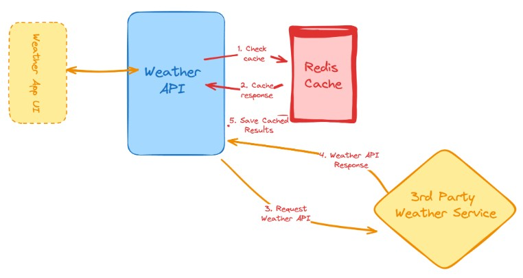

# Weather API Wrapper

A Go REST API that wraps an external weather API with Redis caching. Inspiration: [Weather API](https://roadmap.sh/projects/weather-api-wrapper-service)



## Prerequisites

- Go 1.21+
- Docker (for Redis)

## Configuration

Set the following environment variables (or create a `.env` file):

| Variable | Description | Default |
|----------|-------------|---------|
| `WEATHER_API_KEY` | API key for weather provider | `test_api_key` |
| `WEATHER_API_BASE_URL` | Base URL for weather API | `https://base-url.com` |

## Running

1. Start Redis:
```bash
docker compose -f docker/docker-compose.yml up -d
```

2. Run the server:
```bash
go run cmd/server/main.go
```

The server starts on port `8080`.

## API

### Get Weather

```
GET /weather?city={city}
```

**Response:**
```json
{
  "location": "London",
  "temperature_c": 15.5,
  "condition_text": "Partly cloudy"
}
```

## Testing

```bash
go test ./...
```

## Project Structure

```
.
├── api/
│   ├── dto/          # Data transfer objects
│   ├── handler/      # HTTP handlers
│   └── routes/       # Route definitions
├── cmd/server/       # Application entrypoint
├── docker/           # Docker compose files
├── internal/
│   ├── cache/        # Redis client
│   └── config/       # Configuration
└── weather/          # Weather domain (client, service, repository)
```
